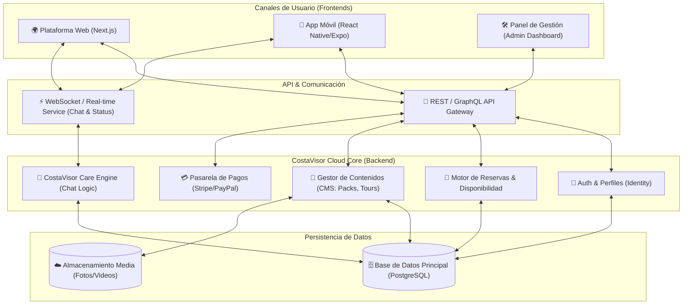

# Arquitectura Técnica y Funcional CostaVisor

## 1. Visión General de la Arquitectura
La plataforma CostaVisor se basa en una arquitectura **"Unified Cloud Core"**. Un núcleo centralizado en la nube alimenta tanto a la Web como a la App Móvil en tiempo real, garantizando consistencia de datos, disponibilidad 24/7 y una experiencia de usuario fluida.

### Diagrama Conceptual (Mermaid)

---

## 2. Estructura Técnica Detallada

### A. Frontend (La Cara Visible)
*   **Web Pública (Next.js):** Elegimos **Next.js** por su velocidad y optimización SEO (crucial para captar turistas en Google). Permite una navegación instantánea y una estética premium.
*   **App Móvil (React Native / Expo):** Usaremos **React Native** para crear una experiencia nativa real en iOS y Android con una sola base de código compartida con la web (lógica de negocio), reduciendo costes de mantenimiento.
*   **Panel de Administración:** Una web privada para que el equipo de CostaVisor gestione reservas, edite Packs y atienda el chat.

### B. Backend (El Cerebro)
*   **API Centralizada:** Un servidor seguro (Node.js/NestJS o similar) que procesa todas las peticiones. Si un usuario reserva en la web, la app móvil se actualiza al instante porque ambas "beben" de la misma API.
*   **Base de Datos (PostgreSQL):** Robusta y escalable. Almacena usuarios, reservas, disponibilidad de motos/barcos y el historial de chat.
*   **Servicio Real-time De Gestión:** Sistema "Push" para que cuando un cliente escriba en el chat o cambie el estado de su reserva, la notificación sea instantánea en todos los dispositivos.

### C. Escalabilidad Futura
Esta arquitectura está diseñada para crecer:
1.  **Modularidad:** Si mañana añadimos "Venta de Inmuebles", se crea un módulo nuevo sin romper el sistema de "Turismo".
2.  **Multi-idioma:** La base de datos está preparada desde el día 1 para almacenar contenidos en *n* idiomas.
3.  **Microservicios (Fase Avanzada):** Si el tráfico se dispara, podemos separar el motor de "Chat" o "Pagos" en servidores independientes para soportar millones de usuarios.

---

## 3. Módulos Funcionales Clave

### 1. Módulo de Experiencias & Holiday Packs (Catálogo)
**Función:** Mostrar de forma seductora qué ofrece CostaVisor.
*   **Gestión:** El equipo carga fotos de alta calidad, precios, y descripciones.
*   **Lógica:** Categorización inteligente (Familias, Parejas, VIP).
*   **UX:** Filtros visuales, videos integrados y tarjetas de producto inmersivas.

### 2. Motor de Reservas (Booking Engine)
**Función:** Convertir el interés en venta.
*   **Calendario Inteligente:** Controla disponibilidad real de activos limitados (ej: solo hay 4 motos de agua a las 10:00).
*   **Validación:** Evita 'overbooking'. Si se vende el último barco en la web, desaparece de la app en milisegundos.
*   **Confirmación:** Generación automática de tickets/vouchers QR.

### 3. Módulo de Pagos (Payment Gateway)
**Función:** Cobrar de forma segura y flexible.
*   **Integración:** Stripe (tarjetas internacionales) + Google Pay / Apple Pay.
*   **Lógica de Pagos:** Soporta pago 100% o señal (depósito) + resto después.
*   **Seguridad:** Cumplimiento PSD2/SCA Europa (máxima seguridad bancaria).

### 4. CostaVisor Care & Chat (El Corazón del Servicio)
**Función:** Asistencia premium humana + automatizada.
*   **Chat Híbrido:** Permite iniciar conversación por App/Web.
*   **Helpdesk:** El mensaje llega a un panel centralizado para el equipo de soporte.
*   **Automatización:** Mensajes de bienvenida automáticos, respuestas rápidas y, a futuro, integración de IA para dudas frecuentes.
*   **Contexto:** Cuando el agente responde, ve al lado qué perfil tiene el cliente (VIP, Familia) y su historial.

### 5. Área Privada de Usuario (Mi Viaje)
*   Repositorio de documentos y reservas.
*   Acceso directo al Chat Care.
*   Historial de pagos.

---

## 4. Integración Web y App (Sincronización)
El secreto es la **"Fuente Única de Verdad"**.
No hay una base de datos para la web y otra para la app. Ambas consultan al mismo **Cloud Core**.
*   **Ejemplo:** Un usuario empieza a ver un "Plan Premium" en su ordenador (Web). Se loguea. Luego baja al sofá, abre la App de CostaVisor en su iPhone, y ve exactamente ese plan marcado como "Favorito" o en su carrito. La continuidad es total.
